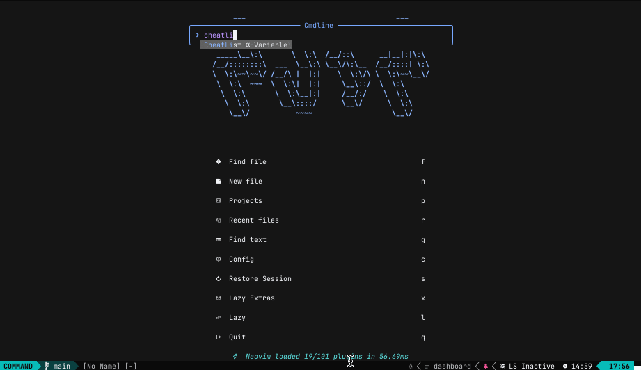

# nvim-cheatsh

`nvim-cheatsh` is a Neovim plugin that integrates with [cheat.sh](https://github.com/chubin/cheat.sh), offering quick access to cheat sheets and documentation for various programming languages, frameworks, and tools directly within your Neovim environment. This plugin utilizes fzf-lua to provide an interactive search interface for finding and viewing cheat sheets.

## Screenshots

### Cheat Command


### CheatList Command



## Features

- **Seamless Integration with fzf-lua**: Leverage fzf-lua's powerful search capabilities to find cheat sheets.
- **Customizable Display Options**: Configure the display position and size of the cheat sheet window according to your preferences.

## Dependencies

- [fzf-lua](https://github.com/ibhagwan/fzf-lua)

## Installation

You can install `nvim-cheatsh` using your favorite package manager along with its dependency.

### Using [packer.nvim](https://github.com/wbthomason/packer.nvim)

```lua
use {
  'siawkz/nvim-cheatsh',
  requires = { {'ibhagwan/fzf-lua'} }
}
```

### Using vim-plug

```lua
Plug 'ibhagwan/fzf-lua'
Plug 'siawkz/nvim-cheatsh'
```

### Using [lazy.nvim](https://github.com/folke/lazy.nvim)

```lua
{
  'siawkz/nvim-cheatsh',
  dependencies = {
    "ibhagwan/fzf-lua",
  },
  opts = {
   -- your configuration comes here
   -- or leave it empty to use the default settings
   -- refer to the configuration section below
  },
}
```

## Configuration

### Setup

nvim-cheatsh comes with a default configuration as shown below:

```lua
{
  cheatsh_url = "https://cht.sh/", -- URL of the cheat.sh instance to use, support self-hosted instances
  position = "bottom", -- position of the window can be: bottom, top, left, right
  height = 20, -- height of the cheat when position is top or bottom
  width = 100, -- width of the cheat when position is left or right
}
```

## Usage

After installation and configuration, you can use nvim-cheatsh with the following commands:

```
:Cheat <query>: Search for a cheat sheet and open a cheat sheet window.
:CheatClose: Close the currently open cheat sheet window.
:CheatList: List available cheat sheets in a fzf-lua picker.
```

#### Query Format

When you enter a query, it's possible to specify the programming language and the topic you're interested in. For example, to search for the C++ RAII principle, you would use:

```sh
:Cheat cpp what is RAII
```

This query gets converted to cpp/what+is+RAII and passed to cheat.sh, fetching the relevant cheat sheet.

## Contributing

Contributions are welcome! If you have any feature requests, bug reports, or suggestions, feel free to open an issue or submit a pull request.

## License

This project is licensed under the MIT License - see the [LICENSE](LICENSE) file for details.
